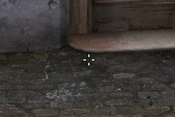

csgo
====

My Counter Strike: Global Offensive Config

Public domain or whatever license you want.

Download the files by clicking on the "Download ZIP" button on the left-hand menu.

Extract the .zip file and place the .cfg files in the following directory:

```
%ProgramFiles(x86)%\SteamApps\common\Counter-Strike Global Offensive\csgo\cfg\
```

Watch this repository so that you will be notified via email about any changes.

Crosshair
---------

Example of what the crosshair looks like in-game:



**TODO: needs an updated screenshot**

Game Launch Options
-------------------

Don't use these unless you have the exact same hardware.

    -refresh 144 -novid -threads 8 -tickrate 128 -console

- Refresh rate set to 144 for Asus VG24BQE
- Novid to skip the intros
- 8 Threads Intel i7-2600k
- Tickrate 128 for local bot games
